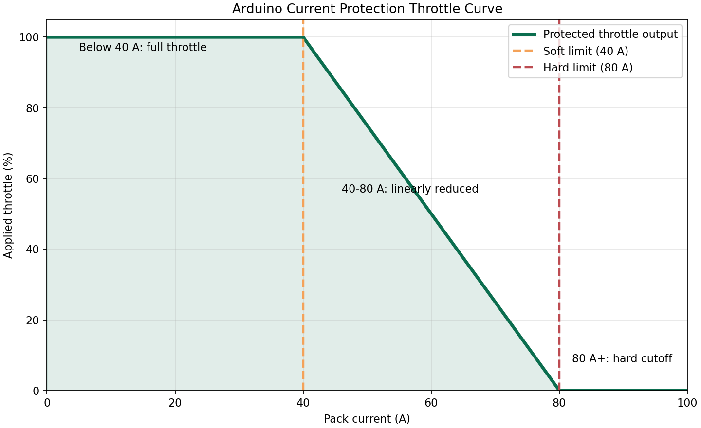

# CAN Throttleator

Converts CAN Throttle messages to analog values to control an electric motor controller. 

## Current Protection Curve

This plot shows the Arduino-side throttle reduction behavior for a 40 A soft limit and an 80 A hard limit.

